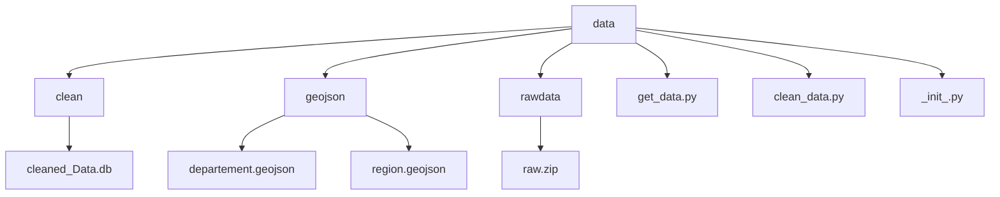
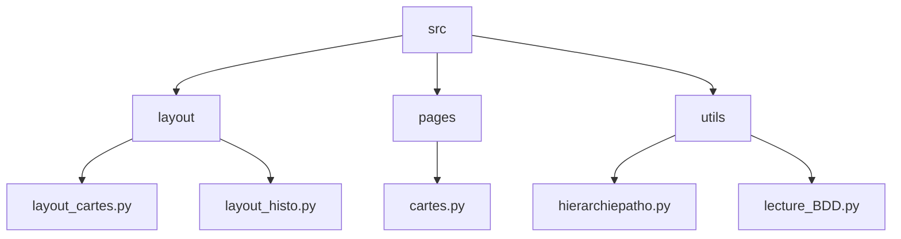
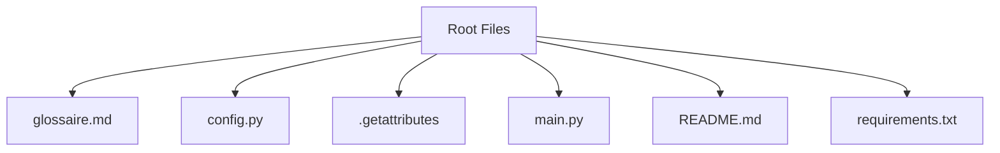

# Pathologies: effectif de patients par pathologie, sexe, classe d'âge et territoire (département, région)
projet data E4 

## User Guide
Pour utiliser notre Dashboard sur une utre machine, il faut faire les actions suivantes à partir de git : 
 ``` 
git clone https://github.com/dinahamadeh-cpu/projet-data-E4.git
python -m pip install -r requirement.txt 
python main.py
``` 

## Data
La base de donnée que nous avons utilisé vient de l'assurance maladie que l'on peut retrouver au lieu suivant : 
https://observatoirepathologies-cnam.opendatasoft.com/explore/dataset/effectifs/information
  Ce jeu de donnée représente les différentes pathologies et sous groupe de pathologies en France. On y retrouver par region et par déparetement des données comme la classe d'âge touchée par la dites pathologies, le sexe, la prévalance et bien d'autres encore. 
  Veuillez vous référez au glossaire pour voir la description des données. 

## Developer Guide 
 ``` 
├── data
│   ├── rawdata
│   │   └── raw.zip
│   ├── clean
│   │   └── cleaned_Data.db
│   └── geojson|
│   │   ├── departement.geojson
│   │   └── region.geojson
│   ├── get_data.py
│   ├── clean_data.py
│   └── _init_.py
├── .gitattributes
├── glossaire.md
├── config.py
├── main.py
├── README.md
├── requirements.txt
└── src
    ├── layout
    │   ├── layout_cartes.py
    │   └── layout_histogrammes.py
    ├── pages
    │   ├── cartes.py
    │   └── histo.py
    └── utils
    │   ├── hierarchiepatho.py
    │   └── lecture_BDD.py
    └── app.py
```





## Rapport d'analyse
Le jeu de données utilisé provient de l’Assurance Maladie et décrit les effectifs de patients pris en charge pour différentes pathologies, ventilés selon des critères démographiques, géographiques et médicaux.
Chaque ligne correspond à un groupe de patients défini par une pathologie donnée et une combinaison sexe × classe d’âge × territoire × année.

Les principales variables de la base sont les suivantes :
Variables temporelles: annee 

Hiérarchie des pathologies:
    -patho_niv1 : groupe principal de pathologies.
    -patho_niv2 : sous-groupe plus précis de pathologies.
    -patho_niv3 : niveau le plus détaillé de la classification.
    -top : libellé technique (code interne) de la pathologie, utilisé pour les systèmes de classification médicale.
Ces trois niveaux permettent d’analyser les pathologies avec une granularité variable

Caractéristiques démographiques
  -cla_age_5 : classe d’âge en tranches de 5 ans
  -libelle_classe_age : version textuelle explicite de la classe d’âge.
  -sexe : code du sexe (ex. 1 = homme, 2 = femme, 9 = ensemble).
  -libelle_sexe : libellé textuel

Informations géographiques
  -region : code de la région concernée 
  -dept : code du département

Indicateurs statistiques
  -Ntop : effectif de patients pris en charge pour la pathologie considérée.
  -Npop : population de référence pour le calcul des prévalences.
  -prev : prévalence (= Ntop / Npop), exprimée en proportion décimale.
 Ces indicateurs sont essentiels pour comparer l’impact des pathologies selon les territoires, les âges ou les sexes.

Nous avons d'autres variables, Niveau prioritaire et tri où nous n'avons pas d'informations. 

Le nettoyage des données a consisté à homogénéiser et vérifier les informations critiques issues du fichier source. Les étapes principales ont été les suivantes : conversion des colonnes numériques (Ntop, Npop, prev, sexe) et des identifiants de département et région en types appropriés, suppression des lignes contenant des informations critiques manquantes (année, pathologies, département, région), filtrage des valeurs aberrantes (dept = 999) et reconstitution des effectifs ou prévalences manquantes lorsque possible. Les valeurs manquantes dans les colonnes de pathologie, d’âge ou de sexe ont été remplacées par des valeurs par défaut ou mappées à partir d’autres colonnes. La variable “Niveau prioritaire” a été uniformisée et tronquée au premier caractère pour simplifier son utilisation. Enfin, les doublons ont été supprimés et la base nettoyée a été enregistrée dans la base SQLite finale. Après le nettoyage des données, la taille de la base de données est de 2752857 lignes et 16 colonnes.

Dans le cadre du nettoyage et de la compréhension de notre jeu de données, nous avons réalisé une analyse exploratoire approfondie, en particulier pour deux variables mal documentées : tri et niveau prioritaire. L’objectif était d’identifier leur nature, leur distribution, leurs relations éventuelles avec d’autres colonnes et leur articulation avec les différentes hiérarchies pathologiques.
L’ensemble des analyses et graphiques associés est disponible dans la branche changement-Achveiya.

L’étude de la variable tri montre qu’il s’agit d’une variable numérique continue, présentant une forte variabilité (de 1 à 78). Les statistiques descriptives et les visualisations correspondantes ( explo_relations.py dans changement-Achveiya) indiquent une distribution large, suggérant que tri constitue un indicateur quantitatif de sévérité ou de criticité associé aux pathologies. Les matrices de corrélation générées dans explo_relations.py confirment qu’il est faiblement lié aux autres variables numériques (Ntop, Npop, prev) : tri capture donc une dimension propre, largement indépendante du volume de cas ou de la prévalence.

La variable niveau prioritaire apparaît comme une catégorie ordinale dérivée directement de tri. Les boxplots réalisés dans explo_tri.ipynb mettent en évidence trois plages cohérentes :

Niveau 1 : tri entre 1 et 19

Niveau 2 : tri entre 20 et 55

Niveau 3 : tri entre 55 et 79

Ces seuils correspondent à des regroupements naturels du degré de sévérité mesuré par tri. L’analyse relationnelle (dans explo_relations.py) montre que les pathologies associées aux valeurs les plus élevées sont des maladies rares, graves ou chroniques, telles que la mucoviscidose, l’hémophilie ou certaines maladies métaboliques — confirmant que niveau prioritaire constitue en pratique une classification qualitative de la gravité, tandis que tri en est la mesure quantitative sous-jacente.

Enfin, l’exploitation des visualisations du fichier explo_relations.py (distributions par âge et sexe, évolutions temporelles, heatmaps de corrélation, relations avec Ntop et prev) permet de replacer tri dans l’ensemble du système de variables et d’établir son rôle comme indicateur central mais relativement indépendant des autres dimensions du dataset.

L’analyse combinée des graphiques révèle des contrastes selon la géographie et les pathologies. Le Tri moyen par région est globalement stable (≈41‑42), à l’exception d’une région plus faible (région 06, ≈33). En revanche, il varie fortement selon les pathologies : le Top 10 des pathologies de niveau 1 présente un Tri moyen allant de 10 (affections de longue durée pour d’autres causes) à près de 60 (maladies inflammatoires, rares ou VIH). Ce contraste se resserre au niveau 2, avec des Tri moyens élevés dominés par les maladies inflammatoires chroniques et rares (≈62‑63). La prévalence, quant à elle, révèle de fortes disparités géographiques, certains départements franciliens et le département 946 affichant des valeurs très élevées (≈13,5%), tandis que d’autres restent autour de 5%. Ainsi, si le Tri moyen régional est stable, il est largement déterminé par la nature des pathologies, alors que la prévalence varie fortement selon le territoire.

Nous avons développé un dashboard interactif avec Dash et Plotly pour explorer les données de pathologies de manière dynamique. Il permet de filtrer les informations par niveau de pathologie, pathologie spécifique, sexe et année. L’interface offre plusieurs visualisations : des histogrammes pour examiner les distributions de tri, Ntop et prévalence, des cartes interactives représentant les données par région ou département, des analyses temporelles pour suivre l’évolution du tri et de la prévalence, ainsi que des boxplots et scatterplots pour étudier les relations entre variables et niveaux prioritaires. Chaque graphique s’adapte automatiquement aux filtres appliqués, permettant d’identifier facilement les tendances, les disparités régionales et les pathologies les plus critiques. L’ensemble du dashboard est accessible via navigateur, offrant une exploration intuitive et complète du jeu de données.


Note : en raison de problèmes avec Git, Achveiya n’a pas pu effectuer tous les commits du dashboard sur la branche principale (main). Les développements ont été réalisés et sauvegardés sur sa branche personnelle.

## CopyRight 
Nous avons utilisés des Intelligence artificielle Générative comme github Copilot ou bien ChatGPT, mais nous avons fait la majorité du code seules. 
Le glossaire reprend toutes les informations données par l'assurance maladie sur le jeu de donnée afin d'éviter des erreurs. 


