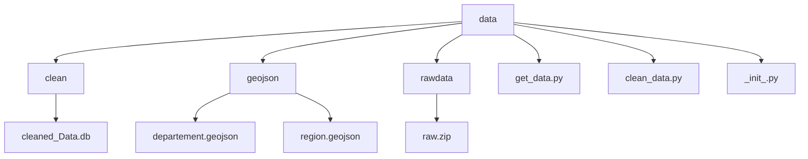

# Pathologies: effectif de patients par pathologie, sexe, classe d'âge et territoire (département, région)
projet data E4 

## User Guide
Pour utiliser notre Dashboard sur une utre machine, il faut faire les actions suivantes à partir de git : 
 ``` 
git clone https://github.com/dinahamadeh-cpu/projet-data-E4.git
python -m pip install -r requirements.txt 
python main.py
``` 

## Data
La base de donnée que nous avons utilisé vient de l'assurance maladie que l'on peut retrouver au lieu suivant : 
https://observatoirepathologies-cnam.opendatasoft.com/explore/dataset/effectifs/information
  Ce jeu de donnée représente les différentes pathologies et sous groupe de pathologies en France. On y retrouver par region et par déparetement des données comme la classe d'âge touchée par la dites pathologies, le sexe, la prévalance et bien d'autres encore. 
  Veuillez vous référez au glossaire pour voir la description des données. 

## Developer Guide 
 ``` 
├── data
│   ├── rawdata
│   │   └── raw.zip
│   ├── clean
│   │   └── cleaned_Data.db
│   └── geojson|
│   │   ├── departement.geojson
│   │   └── region.geojson
│   ├── get_data.py
│   ├── clean_data.py
│   └── _init_.py
├── .gitattributes
├── glossaire.md
├── config.py
├── main.py
├── README.md
├── requirements.txt
└── src
    ├── layout
    │   ├── layout_cartes.py
    │   └── layout_histogrammes.py
    ├── pages
    │   ├── cartes.py
    │   └── histo.py
    └── utils
    │   ├── hierarchiepatho.py
    │   └── lecture_BDD.py
    └── app.py
```


## Rapport d'analyse
toujours plus de blabla 

## CopyRight 
Nous avons utilisés des Intelligence artificielle Générative comme github Copilot ou bien ChatGPT, mais nous avons fait la majorité du code seules. 
Le glossaire reprend toutes les informations données par l'assurance maladie sur le jeu de donnée afin d'éviter des erreurs. 
